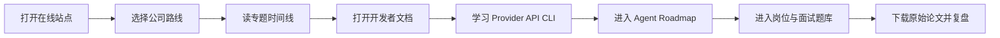

<p align="center">
  <a href="https://harzva.github.io/ChinaAI-Roadmaps/">
    
  </a>
</p>

<div align="center">
  <h1>ChinaAI Roadmaps</h1>
  <p><strong>用论文、技术报告、流程图和交互式网页梳理中国 AI 模型公司的技术路线。</strong></p>
  <p>
    <a href="https://harzva.github.io/ChinaAI-Roadmaps/">在线站点</a>
    ·
    <a href="https://harzva.github.io/ChinaAI-Roadmaps/downloads.html">论文下载中心</a>
    ·
    <a href="https://harzva.github.io/ChinaAI-Roadmaps/developer-docs/">开发者文档</a>
    ·
    <a href="https://harzva.github.io/ChinaAI-Roadmaps/provider-api-cli/">Provider API CLI</a>
    ·
    <a href="https://harzva.github.io/ChinaAI-Roadmaps/agent-roadmap/">Agent Roadmap</a>
    ·
    <a href="https://harzva.github.io/Agent-Job-Interview/">岗位与面试题库</a>
    ·
    <a href="https://harzva.github.io/ChinaAI-Roadmaps/worldroadmap/">全球 AI 模型地图</a>
    ·
    <a href="https://harzva.github.io/ChinaAI-Roadmaps/benchmark-roadmap/">Benchmark 排行榜</a>
    ·
    <a href="content/markdown/paper-downloads.md">Markdown 索引</a>
    ·
    <a href="content/html/analysis_page.html">专题归档</a>
  </p>
  <p>
    
    
    
    
  </p>
</div>

## 为什么看这个仓库

国内模型公司的技术路线很容易散落在论文、发布页、GitHub、技术报告、开发者接口、社区讨论和岗位要求里。这个仓库把它们整理成多个入口：

| 层级 | 你能看到什么 | 入口 |
| --- | --- | --- |
| 交互式站点 | 公司路线、模型分区、DeepSeek V4 技术分析 | [GitHub Pages](https://harzva.github.io/ChinaAI-Roadmaps/) |
| 开发者文档 | DeepSeek、Kimi、GLM、MiMo 的 425 条开发文档快照、搜索筛选与 Adapter 学习路线 | [developer-docs](https://harzva.github.io/ChinaAI-Roadmaps/developer-docs/) |
| Provider API CLI | 多 Provider API CLI、Agent Skills、Native / Compatible / Harness 图文教程 | [provider-api-cli](https://harzva.github.io/ChinaAI-Roadmaps/provider-api-cli/) |
| Agent Roadmap | TUI / IDE / Work Agent、Token Economy、Memory Layer、MiWork 机会分析 | [agent-roadmap](https://harzva.github.io/ChinaAI-Roadmaps/agent-roadmap/) |
| 岗位与面试 | Agent 岗位画像、公司专项、通用题库、实战训练和 12 周冲刺计划 | [Agent-Job-Interview](https://harzva.github.io/Agent-Job-Interview/) |
| 全球模型地图 | 国家、公司、模型族、论文卡片和开源生态关系 | [worldroadmap](https://harzva.github.io/ChinaAI-Roadmaps/worldroadmap/) |
| Benchmark 排行榜 | 233 项 Registry、透明热门集合、来源可追溯 Top-K 与模型比较 | [benchmark-roadmap](https://harzva.github.io/ChinaAI-Roadmaps/benchmark-roadmap/) |
| 论文下载 | 45 个 PDF/报告入口与阅读页 | [downloads.html](https://harzva.github.io/ChinaAI-Roadmaps/downloads.html) |
| 研究笔记 | Markdown 解析、旧版 HTML 专题、流程图素材 | [content/](content/) |

## 研究范围

| 路线 | 重点问题 | 已整理内容 |
| --- | --- | --- |
| GLM / 智谱 | 统一预训练、工具调用、WebGLM、多模态、GLM-5 | [GLM 专题](content/html/glm_analysis.html) |
| Kimi / Moonshot | Muon、长上下文、K2、K2.5、Agentic Intelligence | [Kimi 专题](content/html/kimi_analysis.html) |
| DeepSeek | MoE、Coder、Math、VL、R1、V3/V4、训练与推理效率 | [DeepSeek 专题](content/html/deepseek_analysis.html) |
| MiniMax | MiniMax M3、MSA、1M 上下文、原生多模态、MiniMax Code | [MiniMax 专题](content/html/minimax_analysis.html) |
| Agent / MiWork | Agent 编程、Work Agent、上下文压缩、Token Economy | [Agent Roadmap](agent-roadmap/) |

## 推荐阅读路径



1. 先从 [在线站点](https://harzva.github.io/ChinaAI-Roadmaps/) 建立整体地图。
2. 进入公司专题，理解架构、训练、数据、评测和工程权衡。
3. 到 [开发者文档](https://harzva.github.io/ChinaAI-Roadmaps/developer-docs/) 把模型能力转成可执行 Adapter 和工程检查项。
4. 进入 [Provider API CLI](https://harzva.github.io/ChinaAI-Roadmaps/provider-api-cli/) 理清 Native / Compatible、CLI、Skill、Harness 的执行层级。
5. 进入 [Agent Roadmap](https://harzva.github.io/ChinaAI-Roadmaps/agent-roadmap/) 对齐 Agent 生态、Token Economy 和 MiWork 产品机会。
6. 进入 [岗位与面试题库](https://harzva.github.io/Agent-Job-Interview/) 对齐岗位画像、公司专项、通用题库和实战训练。
7. 到 [论文下载中心](https://harzva.github.io/ChinaAI-Roadmaps/downloads.html) 打开原文，再回到 `content/markdown` 复盘关键贡献。

## 内容资产

| 类型 | 路径 | 说明 |
| --- | --- | --- |
| React 源码 | [`app/`](app/) | 新版交互站点源码 |
| Pages 入口 | [`index.html`](index.html) | 已构建的 GitHub Pages 首页 |
| 开发者文档 | [`developer-docs/`](developer-docs/) | 独立静态子页面，聚合多 Provider API 文档并输出 Adapter 落地路线 |
| Provider API CLI | [`provider-api-cli/`](provider-api-cli/) | 独立工具仓库的精选静态文档镜像，源码维护在 [`Harzva/deepseek-cli`](https://github.com/Harzva/deepseek-cli) |
| Agent Roadmap | [`agent-roadmap/`](agent-roadmap/) | 独立静态子页面，覆盖 Agent 编程、Work Agent、Token Economy 和 MiWork 机会 |
| Agent Roadmap Paper | [`agent-roadmap/paper/`](agent-roadmap/paper/) | arXiv-style survey scaffold，包含 LaTeX 与 BibTeX |
| 岗位与面试 | [Agent-Job-Interview](https://harzva.github.io/Agent-Job-Interview/) | 外部 GitHub Pages 站点，承接岗位画像、面试题库和 Agent 实战训练 |
| 全球模型地图 | [`worldroadmap/`](worldroadmap/) | 独立静态子页面，覆盖全球 AI 公司、模型族和论文关系 |
| Benchmark Registry | [`benchmark-roadmap/`](benchmark-roadmap/) | Registry、热门集合、Top 5/10/全部、来源审计、Map 与模型比较 |
| Benchmark 排行榜路线图 | [`ROADMAP.md`](ROADMAP.md) | 已完成的 1–10 步升级计划与验收证据 |
| arXiv Benchmark 发现 | [`benchmark-roadmap/ARXIV_BENCHMARK_DISCOVERY.md`](benchmark-roadmap/ARXIV_BENCHMARK_DISCOVERY.md) | 每日论文召回、PDF/OCR 成绩取证、Memory 专项与内容素材方案 |
| 下载中心 | [`downloads.html`](downloads.html) | 论文与报告入口 |
| 技术路线图 | [`assets/flowcharts`](assets/flowcharts/) | GLM、Kimi、DeepSeek、MiniMax SVG |
| Markdown 笔记 | [`content/markdown`](content/markdown/) | 论文解析与索引 |
| HTML 归档 | [`content/html`](content/html/) | 旧版专题页 |

## 两个版本如何合并

这个仓库吸收了两个版本的长处：

| 来源 | 长处 | 合并后的角色 |
| --- | --- | --- |
| `ChinaAI-Roadmp` | 论文链接、Markdown 解析、流程图和下载中心更完整 | 资料库底座 |
| `ChinaAI-Roadmpv2` | React 站点、模型分区导航、DeepSeek V4 技术分析更完整 | 新版阅读体验 |

合并后，首页负责快速探索，`downloads.html`、`content/`、`developer-docs/`、`provider-api-cli/`、`worldroadmap/` 和 `agent-roadmap/` 负责长期可复用资料归档。

## 本地开发

根目录已经包含可直接发布的静态产物。开发 React 站点时进入 `app/`：

```powershell
cd app
npm install
node .\node_modules\typescript\bin\tsc -b
node .\node_modules\vite\bin\vite.js build
```

> 当前本地路径包含 `&`，Windows 下 `npm run build` 可能被 `cmd` 截断，因此推荐使用上面的显式 Node 命令。

Benchmark Registry 使用无运行时依赖的静态构建管线：

```bash
cd benchmark-roadmap
npm ci
npm run gates
```

Registry 的大规模实现目录快照可通过 `npm run sync:catalogs` 更新；该命令只更新待审核索引，不能绕过来源、版本和可比性门禁直接生成模型名次。

`gates` 会依次校验身份与引用、重建 Top-K、运行 golden evals、检查链接结构，并扫描公开 JSON 的敏感字段。榜单的来源、可比性和贡献规则见 [`SOURCE_POLICY.md`](benchmark-roadmap/SOURCE_POLICY.md)、[`COMPARABILITY.md`](benchmark-roadmap/COMPARABILITY.md) 与 [`CONTRIBUTING.md`](benchmark-roadmap/CONTRIBUTING.md)。

Agent Roadmap 是纯静态子页面，可直接打开：

```text
agent-roadmap/index.html
```

## 项目边界

本项目用于学习、研究和资料导航。论文、报告和模型版权归原作者或机构所有；仓库只整理公开链接、分析笔记和自制流程图。
