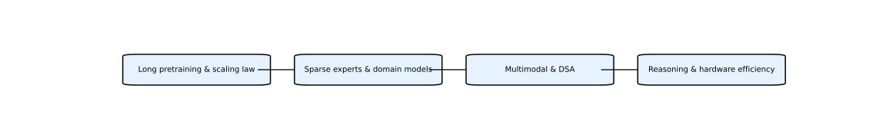

<p align="center">
  <a href="https://harzva.github.io/ChinaAI-Roadmaps/">
    
  </a>
</p>

<h1 align="center">ChinaAI Roadmaps</h1>

<p align="center">
  <strong>GLM · Kimi · DeepSeek · MiniMax 国内开源/开放权重大模型公司技术路线分析</strong>
</p>

<p align="center">
  <a href="https://harzva.github.io/ChinaAI-Roadmaps/">GitHub Pages</a>
  ·
  <a href="https://harzva.github.io/ChinaAI-Roadmaps/downloads.html">论文下载中心</a>
  ·
  <a href="content/markdown/paper-downloads.md">Markdown 索引</a>
  ·
  <a href="content/html/analysis_page.html">专题归档</a>
</p>

<p align="center">
  
  
  
  
</p>

---

## 在线访问

正式站点已经发布到 GitHub Pages。当前首页采用 React + Vite 交互式路线平台，旧版静态专题与下载中心继续保留：

**https://harzva.github.io/ChinaAI-Roadmaps/**

下载页不再使用裸 Markdown，而是独立的专业页面：

**https://harzva.github.io/ChinaAI-Roadmaps/downloads.html**

## 项目定位

这个仓库不做“全 AI 论文大全”，而是聚焦国内开源/开放权重大模型公司的技术路线分析：

| 路线 | 重点 | 专题页 |
| --- | --- | --- |
| GLM | 统一预训练、WebGLM、工具调用、GLM-5 | [GLM 专题](content/html/glm_analysis.html) |
| Kimi | Muon、MuonClip、K2、K2.5、Agentic Intelligence | [Kimi 专题](content/html/kimi_analysis.html) |
| DeepSeek | LLM、MoE、Coder、Math、VL、R1、V3/V3.2 | [DeepSeek 专题](content/html/deepseek_analysis.html) |
| MiniMax | Lightning Attention、CISPO、Forge RL、真实环境 RL | [MiniMax 专题](content/html/minimax_analysis.html) |

新版站点综合了两个版本的优势：

- `ChinaAI-Roadmp`：论文链接、Markdown 解析、流程图与下载中心更完整，是资料库底座。
- `ChinaAI-Roadmpv2`：React 交互站点、模型分区导航、DeepSeek V4 技术分析更完整，是新版阅读体验。
- 合并后：React 首页负责路线探索，`downloads.html` 与 `content/` 负责可复用资料归档。

## 论文下载

已整理：

- 45 个可直接访问的 PDF 入口
- 92 个唯一外链校验通过
- MiniMax-M2.5 保留官方报告与模型页入口
- 校验日期：2026-05-11

入口：[downloads.html](downloads.html)

## 推荐学习路径

1. 打开 [GitHub Pages 首页](https://harzva.github.io/ChinaAI-Roadmaps/) 建立整体地图。
2. 进入某个模型家族专题页，先读时间线和技术路线。
3. 在 [论文下载中心](https://harzva.github.io/ChinaAI-Roadmaps/downloads.html) 下载原论文。
4. 回到 `content/markdown` 下的问答式解析，复盘每篇论文的核心贡献。
5. 使用 `assets/flowcharts` 里的 SVG 作为分享稿、课程或笔记素材。

## 目录结构

```text
.
├─ index.html              # GitHub Pages 首页
├─ downloads.html          # 美化后的论文下载中心
├─ app/                    # React + Vite 新版站点源码
├─ README.md               # GitHub 仓库说明
├─ assets/
│  ├─ site.css             # 统一视觉系统
│  ├─ images/              # 时间线、截图、PNG 素材
│  └─ flowcharts/          # 技术路线 SVG
└─ content/
   ├─ markdown/            # 所有 Markdown 解析和论文索引
   └─ html/                # 原始专题 HTML 归档
```

## 本地查看

仓库根目录已经包含 GitHub Pages 可直接访问的构建产物。React 源码位于 `app/`。

```bash
start index.html
```

开发新版站点：

```powershell
cd app
npm install
node .\node_modules\typescript\bin\tsc -b
node .\node_modules\vite\bin\vite.js build
```

说明：当前本地路径含有 `&`，Windows 下 `npm run build` 可能被 `cmd` 截断，所以这里使用显式 Node 命令。

## 说明

本项目用于学习、研究和资料导航。论文与报告版权归原作者或机构所有；仓库只整理公开链接、分析笔记和自制流程图。

