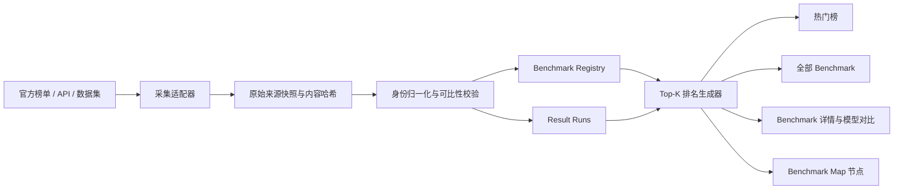

# Benchmark Leaderboard 全面升级路线图

> 状态：Complete · v1.2 · 200+ Registry + arXiv evidence pipeline
>
> 最后更新：2026-07-18
>
> 目标：把现有 Benchmark Map 从“研究导航图”升级为“可追溯、可比较、可持续更新的 Benchmark Registry 与 Top-K 模型排行榜”。

## 完成验收（2026-07-18）

| Step | 状态 | 可复核交付物 |
| ---: | :---: | --- |
| 1 | ✅ | `data/benchmarks.json`、`data/audit/inventory-report.json`；237 项稳定身份，旧地图 framework/audit concept 不混计 |
| 2 | ✅ | benchmark/model/system/result/source JSON Schema；版本、语言、模态、metric direction 与运行配置显式建模 |
| 3 | ✅ | `SOURCE_POLICY.md`、24 组来源、canonical-source / implementation-index 分层、详情 Evidence receipt 与更正/撤回流程 |
| 4 | ✅ | SWE-bench、Hugging Face/OpenEvals、Epoch/METR 适配器及 EleutherAI 目录同步；snapshot、commit、hash、normalize、validate、publish 与失败保留策略 |
| 5 | ✅ | `COMPARABILITY.md`、五字段分组键、三档资格、版本隔离与可比性诊断 |
| 6 | ✅ | 五信号透明热度、75 分门槛、10 项热门集合及构成面板 |
| 7 | ✅ | 237 个确定性榜单 JSON、默认 Top 5、Top 10/全部、开放权重/来源/实体筛选、历史 SOTA 与回归用例 |
| 8 | ✅ | 热门首页、200+ Registry、登记深度筛选、Benchmark/模型详情、2–4 系统比较、共享数据 Map、空/错/无 JS/移动端状态 |
| 9 | ✅ | `npm run gates`、公开字段 allowlist/denylist、Semgrep secrets 0 findings、Playwright smoke、Lighthouse A11y 100 |
| 10 | ✅ | 四条 `benchmark-*.yml` workflow、每日 arXiv 审核 artifact、贡献模板、维护面板、变更日志、发布审计与可回滚 Pages 部署 |

发布质量结果：Lighthouse Performance 97 / Accessibility 100 / Best Practices 100 / SEO 100，TBT 0 ms；移动端 390 px 无页面横向溢出。`npm run gates` 是本地与 CI 的统一发布命令，远端 Pages smoke job 会同时验证排行榜页面和公开快照。

## 后续探索：arXiv 增量发现

200+ Registry 之后的增量来源不能只依赖评测框架目录，还需要从新论文中识别 benchmark、dataset、suite、protocol 和可比成绩。已完成本地 arXiv 日报、PDF 文本层、Poppler 渲染和 Tesseract OCR 的能力核验，并用一篇 cross-episode memory 论文逐表验证 SR/SPL 与 step budget。

完整的来源对比、PDF 取证级联、结构化 claim、New/Rising/Hot 统计、知乎/微信素材流与下一轮 1–10 实施计划见 [`benchmark-roadmap/ARXIV_BENCHMARK_DISCOVERY.md`](benchmark-roadmap/ARXIV_BENCHMARK_DISCOVERY.md)。该阶段已在 v1.2 完成首个端到端闭环：20 篇 PDF golden set、5 个候选、18 条隔离 claim、4 个 collecting 晋升和独立审核台。

## 0. 目标、范围与完成定义

当前 `benchmark-roadmap/data.js` 有 25 个节点，其中约 18 个是真正的 benchmark，另有评测框架和审计概念；React 站点的模型页面还包含约 29 个地图之外的 benchmark 或版本。现有成绩大多写在页面代码里，缺少统一身份、版本、来源和运行配置，不能直接成为可信排行榜。

本轮升级采用两层范围：

- **第一层：Agent Benchmark Leaderboard。** 优先覆盖软件工程、浏览器、桌面 OS、工具调用、企业工作流、长程记忆和知识工作 Agent。
- **第二层：General Benchmark Registry。** 收录仓库已经出现的推理、代码、数学、多模态、长上下文和安全 benchmark，并持续接入官方公开数据源。

这里的“全部”指：仓库已引用的 benchmark，加上已接入官方目录和可信来源的 benchmark；不宣称一次性穷尽全球所有评测。

升级完成需要同时满足：

1. benchmark、模型、运行配置和成绩拥有稳定且可追溯的结构化记录；
2. 每个排行榜只比较可比的 benchmark 版本、subset、metric 和 harness；
3. 每项热门 benchmark 可以展示默认 Top 5，并可展开 Top 10 或全部成绩；
4. 每条成绩带来源、状态、评测日期、抓取时间和必要的 caveat；
5. GitHub Pages 构建、数据校验、敏感信息扫描和更新流程可重复执行。

## 产品原则

- **只在 benchmark 内部排名。** 不把不同量纲的分数简单平均成“全球最佳模型”。
- **榜单实体是系统，而不只是模型。** Agent 榜必须显示模型、agent scaffold、harness、reasoning effort、token/时间预算和尝试次数。
- **官方数据优先。** 优先级为 benchmark 官方榜单或标准化独立评测、独立复现、厂商报告、社区运行；不可确认的数据不进入默认 Top-K。
- **版本不可静默合并。** SWE-bench、SWE-bench Verified、Terminal-Bench 2.0/2.1、tau-bench/tau2-bench 等必须分开建档。
- **“热门”公开可复算。** 热门榜基于数据覆盖、近期引用、活跃度、社区影响和可复现性，不伪装成本站用户行为热度。
- **事实与研究笔记分层。** 排名事实、benchmark 元数据、框架说明和审计方法分别建模。

## 目标架构



---

## Step 1 — 完成全仓 Benchmark 资产盘点与分类

### 目标

建立唯一、可审计的初始清单，先解决“哪些是 benchmark、哪些是版本、哪些只是框架或方法论”的问题。

### 工作项

- 扫描 `benchmark-roadmap/data.js`、`app/src/pages/Benchmarks.tsx` 以及各公司 Benchmark 页面。
- 将现有节点分为 `benchmark`、`suite`、`framework`、`dataset`、`audit_method` 五种类型。
- 合并大小写和拼写别名，但保留版本与 subset，例如：
  - `SWE-Verified` → `SWE-bench Verified`
  - `TerminalBench` → 绑定明确的 `Terminal-Bench 2.0` 或 `2.1`
  - `tau-bench` 与 `tau2-bench` 分开
- 为每项记录 canonical name、aliases、category、owner、homepage、repo、paper、dataset、leaderboard。
- 输出缺失来源、链接失效、版本不明和疑似重复报告。

### 交付物

- `benchmark-roadmap/data/benchmarks.json`
- `benchmark-roadmap/data/audit/inventory-report.json`
- 人类可读的清单统计和待确认队列

### 验收标准

- 仓库现有 benchmark 引用覆盖率达到 100%；
- benchmark、框架和审计概念不再混计；
- 每个条目拥有稳定 `benchmark_id`，别名不会产生重复榜单。

---

## Step 2 — 建立统一数据模型与版本身份

### 目标

让 benchmark、模型和每次评测运行成为相互独立但可关联的实体。

### 工作项

- 建立四类核心实体：
  - `benchmarks`：评测定义、版本、subset、metric 与来源；
  - `models`：模型、组织、发布时间、开放权重状态；
  - `systems`：模型与 agent scaffold、工具、harness 的组合；
  - `results`：某个 system 在某个 benchmark version 上的一次成绩。
- 统一 metric 字段：名称、单位、排序方向、最佳/人类基准、是否允许并列。
- 对 benchmark 的版本、subset、语言、模态和时间窗口做显式建模。
- 给来源状态建立固定枚举：
  - `official`
  - `independent`
  - `vendor_reported`
  - `community`
  - `unverified`
- 为所有 JSON 增加 JSON Schema，并保留 schema version。

### 交付物

- `benchmark-roadmap/schema/*.schema.json`
- `benchmark-roadmap/data/models.json`
- `benchmark-roadmap/data/systems.json`
- `benchmark-roadmap/data/results.json`

### 验收标准

- 同一个模型可以关联多个运行配置；
- 同一个 benchmark 可以安全存在多个版本和 subset；
- schema 校验能拒绝缺少来源、指标方向或身份字段的成绩。

---

## Step 3 — 建立来源政策、证据等级与可追溯记录

### 目标

保证排行榜中的每个数字都能回答“从哪里来、何时取得、使用什么配置”。

### 工作项

- 优先接入 benchmark 官方榜单、官方数据集和标准化独立评测。
- 为每条成绩保存：
  - `source_url`
  - `source_type`
  - `evaluation_date`
  - `retrieved_at`
  - `content_hash`
  - `benchmark_version`
  - `run_config`
  - `notes` / `caveats`
- 将厂商模型卡成绩与独立运行分开，禁止自动合并或平均。
- 为失效链接、无日期来源、截图来源、二手转载设置降级策略。
- 建立来源更正和撤回机制；原记录保留审计历史，不静默覆盖。

### 首批参考与数据源

- [Hugging Face Benchmark Leaderboard API](https://huggingface.co/docs/hub/leaderboard-data-guide)
- [Epoch AI Benchmarking Hub](https://epoch.ai/benchmarks)
- [Artificial Analysis Evaluations](https://artificialanalysis.ai/evaluations)
- 各 benchmark 官方 GitHub、论文、项目页和排行榜
- [evals.report](https://evals.report/benchmarks) 仅作为产品结构和来源线索参考，不直接无授权镜像其数据库

### 交付物

- `benchmark-roadmap/SOURCE_POLICY.md`
- `benchmark-roadmap/data/sources.json`
- 成绩来源审计页面或详情抽屉

### 验收标准

- 默认 Top-K 中 100% 的成绩可点击回到原始或标准化来源；
- 无来源、来源失效或版本不明的成绩不会进入默认榜单；
- 用户可以区分官方、独立、厂商和社区结果。

---

## Step 4 — 构建可重复的数据采集与增量更新管线

### 目标

用数据适配器替代手工把成绩写进 TSX 或地图节点。

### 工作项

- 建立 source adapter 接口，统一输出内部 `results` 格式。
- 第一批实现：
  - Hugging Face 官方 leaderboard API；
  - Hugging Face `OpenEvals/leaderboard-data` 聚合数据；
  - Epoch AI 可下载数据；
  - 重点 Agent benchmark 官方榜单适配器。
- 将抓取分为 `fetch → snapshot → normalize → validate → publish` 五阶段。
- 缓存原始响应的元数据与内容哈希，避免来源未变时重复更新。
- 对需要登录、私有数据或禁止自动抓取的来源采用人工审核导入，不绕过访问限制。
- 失败时保留上一次验证通过的公开数据，避免空榜覆盖线上页面。

### 交付物

- `benchmark-roadmap/scripts/fetch-*.mjs`
- `benchmark-roadmap/scripts/build-leaderboards.mjs`
- `benchmark-roadmap/data/raw-manifest.json`
- `benchmark-roadmap/data/public/*.json`

### 验收标准

- 在全新环境中可用单条命令生成相同的公开数据；
- 单一数据源故障不会破坏其他榜单；
- 重复运行具有幂等性，且能输出新增、更新、删除和降级摘要。

---

## Step 5 — 建立可比性规则与排名资格门槛

### 目标

避免把不同版本、不同 harness、不同预算或不同评分方法的结果错误排在一起。

### 工作项

- 排名分组至少包含：`benchmark_id + version + subset + metric + protocol`。
- Agent 结果必须显示并尽可能约束：
  - agent scaffold / harness；
  - reasoning effort；
  - token、步骤、时间或美元预算；
  - pass@1、pass@k 和尝试次数；
  - 工具、浏览器和环境版本。
- 建立 `comparable`、`partially_comparable`、`not_comparable` 三档判断。
- 缺少关键配置的成绩可以展示在“其他报告”中，但不进入默认 Top-K。
- 为分数并列、置信区间重叠、lower-is-better 指标和缺失值制定统一规则。
- 对已饱和、已废弃和长时间未更新的 benchmark 标记生命周期状态。

### 交付物

- `benchmark-roadmap/COMPARABILITY.md`
- 可比性校验器与诊断报告
- 页面上的版本、subset、harness 和状态筛选器

### 验收标准

- Terminal-Bench 2.0 与 2.1 不会出现在同一默认排名；
- SWE-bench Full、Lite、Verified、Pro 不会被错误合并；
- 每个被排入 Top-K 的结果都能解释其可比性依据。

---

## Step 6 — 建立透明的“热门 Benchmark”评分与独立集合

### 目标

将高价值 benchmark 单独展示，同时保证“热门”可解释、可复算、可审计。

### 热度评分

| 信号 | 权重 | 说明 |
| --- | ---: | --- |
| 活跃公开排行榜 | 35 | 是否持续更新且有足够模型覆盖 |
| 近期模型报告采用度 | 25 | 最近多个主流模型发布是否使用 |
| 学术与社区影响 | 15 | 论文引用、GitHub 关注和生态采用 |
| 数据新鲜度 | 15 | benchmark、数据或榜单近期是否维护 |
| 可复现性 | 10 | 是否有公开数据、harness 和运行说明 |

进入“热门”集合的建议门槛：总分不低于 75，且至少有两个相互独立的有效信号。评分必须显示更新时间和构成，不使用虚构的访问量或用户投票。

### 首批候选

- Agent：SWE-bench Verified、Terminal-Bench 2.1、OSWorld、GAIA、tau2-bench、WebArena、BrowseComp、GDPval、MCP Atlas、Remote Labor Index、METR Time Horizon。
- General：GPQA Diamond、Humanity's Last Exam、LiveBench、LiveCodeBench、MMLU-Pro、FrontierMath、AIME、MMMU-Pro。

候选不等于自动入榜；必须先完成来源和活跃度验证。

### 交付物

- `benchmark-roadmap/data/popularity-signals.json`
- `benchmark-roadmap/data/public/hot-benchmarks.json`
- 热度计算脚本和解释面板

### 验收标准

- 任一热门条目都能展示各信号分值与证据；
- 热度更新不会改变 benchmark 的能力成绩；
- 失活或饱和 benchmark 可以自动进入观察或历史状态。

---

## Step 7 — 实现可信的 Top-K 排名生成器

### 目标

为每个 benchmark 自动生成可解释的 Top 5、Top 10 和完整排名。

### 工作项

- 默认展示 Top 5，允许用户展开 Top 10 或全部结果。
- 排名键由 metric direction、成绩、置信信息和并列规则决定。
- 同一模型存在多个配置时，默认保留最佳合格配置，同时允许展开其他配置。
- 提供筛选：
  - 全部 / 开放权重；
  - 官方与独立 / 包含厂商报告 / 包含社区运行；
  - 模型 / 完整 Agent system；
  - 版本、subset、语言和模态。
- 每个榜单显示数据快照时间、覆盖模型数、metric、排序方向和 caveat。
- 为历史结果保留时间线，支持查看“当时的 SOTA”而不覆盖旧记录。

### 交付物

- `benchmark-roadmap/data/public/leaderboards/*.json`
- Top-K 排名生成与稳定排序测试
- 模型和实验配置展开视图

### 验收标准

- 相同输入始终生成相同排名；
- 并列和 lower-is-better 指标排序正确；
- 每个 Top-K 项都能回溯到一条完整的 result record。

---

## Step 8 — 升级页面信息架构与 Benchmark Map 联动

### 目标

保留现有世界地图的探索感，同时提供高密度、易比较的排行榜体验。

### 页面结构

1. **热门榜首页**：热门 benchmark 卡片，每项展示 Top 3、更新时间和可信状态。
2. **全部 Benchmark**：分类、搜索、热度、生命周期、来源覆盖和数据新鲜度。
3. **Benchmark 详情**：介绍、版本、metric、Top-K、运行配置、来源和历史趋势。
4. **模型详情**：一个模型在不同 benchmark 中的成绩，但不生成无意义的跨榜平均。
5. **对比页面**：选择 2–4 个模型，只比较共同覆盖且可比的 benchmark。
6. **Map 模式**：节点显示当前领先系统、Top 3 摘要和数据状态，点击进入详情。

### 交互要求

- 桌面和移动端均可读；表格支持键盘操作和明确焦点状态。
- 颜色不是排名和状态的唯一表达方式。
- 缺失数据、未验证结果和不可比较结果必须使用明确文案。
- 旧的地图 URL 和 `benchmarkroadmap` 重定向保持兼容。

### 交付物

- 新的排行榜组件与详情视图
- 与 `roadmap-core` 的数据接口
- 空状态、加载状态、错误状态和移动端样式

### 验收标准

- 用户可以在三次交互内从热门榜进入某项完整 Top-K；
- 地图、列表和详情使用同一份公开数据；
- Lighthouse 可访问性、移动端和性能检查达到项目约定门槛。

---

## Step 9 — 建立数据质量、测试、安全和发布门禁

### 目标

在数据进入 GitHub Pages 前自动发现错误、失效来源和敏感信息。

### 工作项

- 数据测试：schema、唯一 ID、别名冲突、孤立引用、重复成绩、metric 方向。
- 排名测试：版本隔离、并列、置信区间、lower-is-better、缺失值。
- 来源测试：链接状态、来源类型、日期、内容哈希和过期提示。
- UI 测试：关键页面 smoke test、移动端、键盘导航和无 JavaScript 降级说明。
- 回归测试：现有 Agent、Reasoning、Multi-Agent、World Map 入口不受影响。
- 安全扫描：禁止提交 token、cookie、`.env`、凭据转储、原始聊天记录和私有本机路径。
- 生成物只包含公开字段；抓取调试信息、内部错误和维护备注不进入 Pages。

### 交付物

- `benchmark-roadmap/scripts/validate-data.mjs`
- 自动化测试与链接检查
- 公共字段 allowlist / 私有字段 denylist
- 发布前审计报告

### 验收标准

- 任一必填字段、来源或可比性错误都会阻止发布；
- 公开构建产物通过敏感信息与私有路径扫描；
- 现有地图入口和 GitHub Pages smoke test 全部通过。

---

## Step 10 — 上线 CI/CD、更新治理与阶段验收

### 目标

让排行榜成为可长期维护的产品，而不是一次性的静态页面。

### 工作项

- GitHub Actions 分为：
  - PR 数据与页面校验；
  - 定时检查数据源；
  - 人工审批后的数据发布；
  - GitHub Pages 构建和 smoke test。
- 自动更新只创建可审阅的 diff 或 PR；来源变化不直接无审核覆盖生产数据。
- 为 benchmark 新增、成绩更正、来源撤回和版本弃用建立贡献模板。
- 发布数据快照、变更日志和回滚点。
- 建立维护面板：来源健康、最后成功同步、待验证结果、失效链接和 stale benchmark。
- 完成三阶段验收：
  - **M1 Registry**：清单、schema、来源政策和初始数据；
  - **M2 Leaderboard**：热门榜、Top-K、详情和可比性规则；
  - **M3 Production**：自动化、测试、Pages 发布和维护文档。

### 交付物

- `.github/workflows/benchmark-*.yml`
- `benchmark-roadmap/CONTRIBUTING.md`
- `benchmark-roadmap/CHANGELOG.md`
- 可回滚的 GitHub Pages 发布

### 验收标准

- 从来源更新到审阅、校验、构建和发布的流程有完整证据链；
- 失败更新不会污染生产榜单；
- 本地数据、Git 状态、GitHub 远端和 Pages 产物保持一致。

---

## 推荐实施顺序

```text
M1 · Registry Foundation
Step 1 → Step 2 → Step 3

M2 · Data and Ranking
Step 4 → Step 5 → Step 6 → Step 7

M3 · Product and Production
Step 8 → Step 9 → Step 10
```

每个 Step 必须先通过自己的验收标准，再进入下一阶段；不能为了尽快展示排行榜而跳过版本身份、来源和可比性。

## 第一版发布边界

第一版建议优先交付 12–20 个数据质量最高的 Agent benchmark，而不是同时发布大量缺少来源的空榜。其余 benchmark 先进入 Registry，状态标记为 `collecting`、`needs_source`、`legacy` 或 `ready`。随着官方来源和可比成绩完成审计，再逐项进入 Top-K。

第一版 Top-K 默认值为 5；页面可展开到 Top 10 或全部。默认榜单只采用 `official` 和 `independent` 结果，厂商与社区运行通过筛选器显示。

## 不在本轮范围内

- 自行运行所有高成本 benchmark；
- 未经授权镜像第三方商业排行榜数据库；
- 将不同 benchmark 的分数直接平均成单一总榜；
- 使用不可验证的宣传数字填充空榜；
- 在公开仓库保存凭据、私有 API 响应或受限数据集内容。
