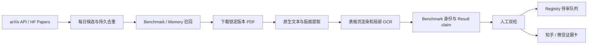

# arXiv Benchmark Discovery 与 PDF 成绩取证方案

> 状态：Exploration complete · implementation proposal
>
> 调研日期：2026-07-18
>
> 目标：持续发现论文中新发布或新采用的 benchmark、dataset、suite 与评测协议，并把可复核的成绩证据送入人工审核队列，而不是直接污染 Top-K。

## 结论

可行，而且值得成为 200+ Registry 的下一条增量来源。现有本地 arXiv 日报已经能完成“检索、去重、下载 PDF、中文摘要和自媒体选题”，但还缺少 benchmark 专用的身份判断、表格成绩提取、可比性审计和证据坐标。

推荐的最小改造不是再造一个通用论文阅读器，而是在现有日报之后增加 `benchmark evidence` 分支：



每日发现可以自动化，成绩发布不能全自动化。OCR、PDF 阅读顺序和作者自报结果都会产生误差；所有数字进入默认 Top-K 前仍需通过版本、协议、指标、运行配置和来源资格门禁。

## 已有能力与缺口

### 本地可直接复用

- arXiv 检索工具：支持关键词、日期、ID 查询、元数据获取和 PDF 下载，底层使用 `arxiv.py`。
- 日报工作流：已有按关键词检索、持久 ledger 去重、PDF 下载、中文摘要、选题角度和静态阅读页。
- PDF 基础栈：Poppler 可读取元数据和渲染指定页面；`pdfplumber` / `pypdf` 可处理带文本层的数字 PDF。
- OCR 回退：Tesseract 5.5.2 可用，目前安装了英文识别数据，适合英文论文扫描页。

### 仍需补齐

- 把“论文提到 benchmark”区分为“论文发布新 benchmark”“论文只使用旧 benchmark”“论文提出新 protocol”。
- 从表格中提取 `model/system × dataset/version/subset × metric × score × run config`，并保存页码、表号、行列和 PDF 哈希。
- 将论文作者自报结果与 benchmark 官方榜单、独立复现分层，禁止无条件合并。
- 对同一 arXiv ID 的 v1/v2/v3 做版本化；新版本不能静默覆盖旧分数。
- 把“今日新增”和“热门 benchmark”分开。新不等于热，热度需要多源采用信号。

## 可参考的项目与取舍

| 项目 | 适合借鉴的部分 | 本项目建议 |
| --- | --- | --- |
| [arXiv API](https://info.arxiv.org/help/api/user-manual.html) | 官方查询、分页、提交/更新时间和 Atom 元数据 | 作为论文元数据事实源；缓存每日查询并遵守 3 秒请求间隔 |
| [lukasschwab/arxiv.py](https://github.com/lukasschwab/arxiv.py) | Python API wrapper、重试、分页、PDF/源码下载 | 继续作为本地采集层，避免重复造 CLI |
| [Hugging Face `hf papers`](https://huggingface.co/docs/huggingface_hub/en/guides/cli#hf-papers) | daily、trending、关键词搜索、结构化 info 与论文 Markdown | 作为第二召回源和热度线索，不替代 arXiv 版本事实源 |
| [daily-arXiv-ai-enhanced](https://github.com/dw-dengwei/daily-arXiv-ai-enhanced) | 每日抓取、结构化摘要、JSONL 和静态页面 | 借鉴信息架构；去重必须保留永久 ledger，不能只保留短窗口 |
| [hermes-arxiv-agent](https://github.com/genggng/hermes-arxiv-agent) | PDF 下载、中文摘要、通知与内容消费界面 | 直接扩展现有本地流程，新增 benchmark 分支 |
| [PyMuPDF4LLM](https://github.com/pymupdf/pymupdf4llm) | 多栏阅读顺序、表格、Markdown/JSON、选择性 OCR | 先做隔离技术验证；引入生产前审查 AGPL 许可影响 |
| [Docling](https://github.com/docling-project/docling) | 复杂版面、表格和结构化文档转换 | 作为困难 PDF 的可选重型回退，不放在每日默认路径 |
| [MinerU](https://github.com/opendatalab/MinerU) | 复杂论文转 Markdown/JSON | 作为中文和复杂公式表格的对照实验，先审查许可与模型成本 |

首选组合是 `arXiv API/arxiv.py + 现有日报 + Poppler + pdfplumber + Tesseract`。这样今天就能运行。PyMuPDF4LLM、Docling 或 MinerU 应通过固定的 20–50 篇困难论文评测集比较准确率后再选择，不应一次全部安装。

## 每日发现策略

### 1. 查询桶

每日按类别 `cs.AI`、`cs.CL`、`cs.CV`、`cs.LG`、`cs.RO`、`cs.SE`、`cs.IR` 建立四组召回：

1. 新基准强信号：标题或摘要含 `benchmark`、`bench`、`evaluation suite`、`leaderboard`、`dataset`。
2. 发布声明：`we introduce/present/propose/release` 与 `benchmark/dataset/evaluation protocol` 共现。
3. 成绩信号：`state-of-the-art`、`outperform`、`accuracy`、`success rate`、`SPL`、`pass@k`、`win rate` 等。
4. Memory 专项：`agent memory`、`long-term memory`、`episodic memory`、`cross-episode`、`continual agent`、`memory benchmark`、`long context`、`retrieval memory`。

关键词只负责高召回，不负责最终分类。标题带 Bench 可能只是方法名，论文也可能在正文或附录才定义新评测。

### 2. 候选打分

候选论文可按以下信号排序，但不直接决定是否收录：

- 标题含 Benchmark/Bench：+4
- 摘要出现发布声明与 benchmark 共现：+4
- 摘要出现数据规模、任务数或模型数：+2
- 论文代码、数据集或 leaderboard 链接可访问：每项 +1
- Memory 专项词与 agent/evaluation 共现：+2
- 仅在 related work 中出现 benchmark：-3

### 3. 永久 ledger

至少按 `arxiv_id + version` 保存：首次发现、最近更新、查询桶、PDF 哈希、抽取状态、审核状态和内容选题状态。`2607.14514v1` 与未来 `v2` 必须是两个证据版本，并通过 parent ID 关联。

本地 2026-07-18 的一次运行已经从 171 篇候选中选出 5 篇并下载 PDF，其中包含 REAL-Bench、SafeRelBench、UESF-Bench 和一篇跨 episode memory 评测论文，说明该漏斗具备实际产出。

## PDF 取证级联

### Level 0 — 文件与版本安全

- 从官方 arXiv PDF URL 下载锁定版本。
- 记录 arXiv version、下载时间、字节数、页数和 SHA-256。
- 检查加密、嵌入脚本、异常附件；不执行 PDF 内代码。

### Level 1 — 原生文本优先

- 检测每页是否存在可用文本层。
- 提取标题、摘要、章节、表格 caption、脚注和附录。
- 用 `Table N`、metric 词和 benchmark 名定位候选页。

数字 PDF 不应先 OCR。原生文本通常更准、更快，也不会把小数点和数学符号二次破坏。

### Level 2 — 版面与表格

- 保存 page-level blocks、bounding boxes 和阅读顺序。
- 对每张候选表保存 caption bbox、table bbox、行列标题和脚注。
- 表格自动提取失败时，把候选页或表格 crop 渲染为 200–300 DPI 图片。

### Level 3 — 局部 OCR / 视觉复核

- 只 OCR 无文本层或表格解析失败的局部区域。
- OCR 输出必须与原生文本、视觉页面和论文叙述三方校对。
- 小数点、百分号、上下箭头、粗体最佳值、脚注星号和破折号是重点错误位。

### Level 4 — 证据化人工审核

审核员看到的不是孤立数字，而是“PDF 页图 + 表 caption + 行列定位 + 结构化 claim + 原文上下文”。每条成绩至少通过一次逐格复核；进入热门榜或 Top-K 的成绩再做第二次独立复核。

## 结构化数据模型

发现管线先写入 staging，不直接改 `results.json`：

```json
{
  "claim_id": "arxiv-2607.14514v1-table1-vtm-nav-hm3d-v01-sr",
  "paper": {
    "arxiv_id": "2607.14514",
    "version": "v1",
    "pdf_sha256": "fcfccd59ce91a3ecbfce87eb56fd73b5e150b7f7932e413ef28b09214c430bb9"
  },
  "entity_kind": "protocol",
  "entity_name": "Cross-Episode Object-Goal Navigation",
  "dataset": "HM3D",
  "dataset_version": "v0.1",
  "system": "VTM-Nav + Qwen3-VL-Plus",
  "run_config": { "max_steps": 40, "training_free": true, "zero_shot": true },
  "metric": { "name": "SR", "direction": "higher", "unit": "percent" },
  "value": 59.6,
  "evidence": { "pdf_page": 8, "table": "Table 1", "row": "VTM-Nav", "column": "HM3D v0.1 / SR" },
  "status": "human_verified",
  "ranking_eligible": false,
  "caveat": "论文作者自报；需与 Registry 的 HM3D protocol、episode budget 和来源资格对齐。"
}
```

建议新增四层暂存实体：

- `paper_record`：arXiv 元数据、版本、PDF 与哈希。
- `benchmark_candidate`：论文是否发布/使用 benchmark 的机器判断与人工结论。
- `result_claim`：论文中的原子成绩声明和精确证据坐标。
- `review_decision`：接受、合并、降级、拒绝及原因。

`entity_kind` 至少支持 `benchmark`、`suite`、`dataset`、`protocol`。方法名、模型名和论文标题不能自动变成 benchmark 名。

## VTM-Nav：Memory 论文取证样例

论文：[VTM-Nav: Hierarchical Visual-Topological Memory for Cross-Episode Object-Goal Navigation](https://arxiv.org/abs/2607.14514v1)。本地核验对象为 12 页数字 PDF，SHA-256 为 `fcfccd59ce91a3ecbfce87eb56fd73b5e150b7f7932e413ef28b09214c430bb9`；原生文本可用，因此 OCR 只用于交叉检查。

### 论文究竟发布了什么

论文提出的是 `Cross-Episode Object-Goal Navigation` 评测协议和 VTM-Nav 方法；它在 HM3D v0.1、HM3D v0.2 与 MP3D 上评测。Registry 应新增或关联 protocol，而不是虚构一个“VTM-Nav Benchmark”。

### 可复核成绩

Table 1，Qwen3-VL-Plus、40 steps：

| Dataset | System | SR | SPL |
| --- | --- | ---: | ---: |
| HM3D v0.1 | WMNav reproduction | 55.0 | 31.7 |
| HM3D v0.1 | WMNav + Textual Memory reproduction | 56.5 | 31.1 |
| HM3D v0.1 | VTM-Nav | 59.6 | 31.8 |
| HM3D v0.2 | WMNav reproduction | 70.0 | 30.0 |
| HM3D v0.2 | WMNav + Textual Memory reproduction | 66.5 | 31.2 |
| HM3D v0.2 | VTM-Nav | 72.0 | 31.5 |

同一表还有 VTM-Nav 的 HM3D v0.1、500-step 结果 `65.3 SR / 32.1 SPL`，它不能与 40-step 行直接混排。

Table 2，MP3D、Qwen3-VL-Plus、40 steps：WMNav reproduction 为 `43.5 SR / 15.6 SPL`，VTM-Nav 为 `44.3 SR / 16.2 SPL`。

Table 5 的 early-to-late 结果显示 VTM-Nav 在 HM3D v0.2 的 SR 从 `70.8` 到 `73.4`，变化 `+2.7`；这是跨 episode 学习趋势，不是 Table 1 的总体 SR，二者不能当成同一成绩。

### OCR 风险实证

Tesseract 能读出表格结构，但会把 `59.6` 识别成 `596`、把 `44.3` 识别成 `443`，并可能混淆 `VL`、`V1`、勾号和乘号。这证明：OCR 可用于定位和补漏，不能作为无人复核的排行榜数字源。

## “新”与“热门”的统计方法

页面应分别展示：

- `New papers`：按 arXiv 首次提交或版本更新时间统计。
- `New benchmark candidates`：每日经 PDF 确认的新 benchmark/suite/dataset/protocol。
- `Rising`：30/90 天内被多篇独立论文采用、出现实现或 leaderboard 活动。
- `Hot`：达到现有透明热度门槛的稳定条目。

Memory 可以作为专题 watchlist，但仍使用同一套可解释信号：

1. 30/90 天独立采用论文数；
2. 官方 repo、数据集和 leaderboard 是否存在且活跃；
3. 是否出现多个组织的可比结果；
4. 是否进入主流 harness；
5. 版本、协议和许可证是否清楚；
6. Registry 是否已有足够证据生成 Top-K。

单篇论文的宣传语、单次高分或标题包含 `Bench` 都不能直接获得 Hot 标记。

## 知乎与微信素材输出

只有 `human_verified` 的 claim 才能进入内容卡。每篇论文可生成两种素材：

- 快讯卡：论文解决什么、发布了何种实体、规模、最关键数字、局限和原文链接。
- 深读卡：评测协议、对照组、表格证据、是否公平可比、对 Agent/Memory 产品的启示。

内容卡必须回链到 `arxiv_id + version + page/table`，并明确区分“作者报告”“独立复现”“本站判断”。排行榜数据与观点文案共用证据层，但不共用未经审核的结论字段。

VTM-Nav 可形成两个选题：

- “Agent 每次进房间都失忆？跨 episode memory 到底提升了多少”
- “一篇论文里的新 protocol，为什么不能直接算成一个新 benchmark”

## 1–10 实施计划

1. 固化 benchmark/memory 查询词、arXiv 类别、每日时间窗口和 API 缓存策略。
2. 扩展永久 ledger，按 arXiv ID、version、PDF hash 去重并记录状态迁移。
3. 新建 staging schema：paper、candidate、claim、review 四类记录。
4. 实现 PDF 安全检查、原生文本检测、caption/metric 页定位和页面渲染。
5. 实现表格抽取级联；建立 20–50 篇含多栏、跨页表、扫描页的 golden PDF 集。
6. 增加 benchmark/dataset/suite/protocol 分类器和 Registry 名称消歧。
7. 增加逐格审核界面，显示 page crop、表头、脚注、claim 与差异。
8. 让审核通过的 benchmark 身份进入 Registry collecting；成绩先进入 paper-reported 隔离区。
9. 接入采用速度、repo/leaderboard 活跃度和独立结果，计算 New/Rising/Hot。
10. 生成可追溯日报、周报、知乎/微信素材包，并通过现有 CI、安全扫描和 Pages smoke 后发布。

## 验收门槛

- 每日任务失败时保留上一份合格快照，不发布空结果。
- 对已下载论文永久去重，同时能识别新版本并重新抽取差异。
- benchmark 新建准确率、实体类型准确率和表格数字准确率分别在 golden 集上量化。
- 每个数字都有 arXiv version、PDF hash、页码、表号、行列、metric direction 和 run config。
- OCR 数字未经人工复核不得进入公开榜单。
- 论文作者自报、官方榜单、独立复现和社区结果在 UI 中可区分。
- 40-step 与 500-step、不同 dataset version/subset/harness 不会进入同一可比组。
- 公开产物不包含本地绝对路径、凭据、Cookie、私有日志或原始聊天记录。

## 推荐的下一项实现

先完成 Step 1–5 的最小闭环：每天生成 `paper candidates → PDF evidence → review queue`，暂不自动写入 Top-K。用 VTM-Nav、SafeRelBench、REAL-Bench、UESF-Bench 与 AdaTurn 作为首批 golden papers，验证实体分类、表格数字和证据坐标，再决定是否引入 PyMuPDF4LLM 或重型文档模型。
