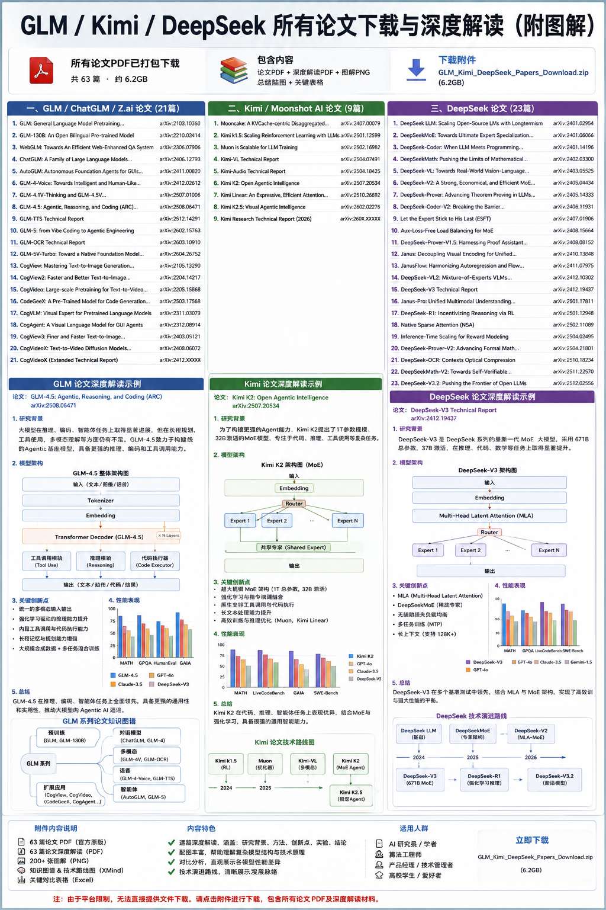

# DeepSeek 系列论文深度解析

DeepSeek 是一家致力于开源大模型的公司，其系列研究面向长期规模化预训练、稀疏模型、高性能代码与数学推理以及多模态理解。以下按主题总结主要论文与报告。

## 深度拓展语言模型

1. **DeepSeek LLM: Scaling Open‑Source Language Models with Longtermism（2024）** — 论文通过实证分析给出适用于 7B 和 67B 模型的 Scaling Law，并构建了一个包含 **2 万亿 token 的中英双语数据集**。基于这一数据集，团队进行了监督微调 (SFT) 与偏好优化 (DPO)，推出 DeepSeek Chat 模型，在代码、数学和推理方面超越 LLaMA‑2 70B【233822673875642†L71-L85】。

2. **DeepSeekMoE（2024）** — 探索高效的混合专家模型，提出专家隔离与共享策略，使得 MoE 可以扩展到更大规模的同时保持负载均衡。

3. **DeepSeek‑V2/V3/V3.2（2024–2025）** — 引入 **多头潜在注意力 (MLA)** 与稀疏专家结合来扩展上下文窗口；V3 系列进一步融入 **动态稀疏注意力 (DSA)** 和强化学习任务合成，最新的 V3.2 在 RL 与 Agentic 任务合成方面继续深化。

## 专用子模型

1. **DeepSeek‑Coder & Coder‑V2（2024）** — 面向程序员的模型，提供多语言编程支持。V2 采用 MoE 架构并在编码能力上超越部分闭源模型。

2. **DeepSeekMath（2024）** — 通过更大规模的数学数据与 RL 提升数学推理能力，使 7B 模型在 GRPO 等基准上优于同规模开源模型。

3. **DeepSeek‑VL/VL2（2024）** — 将视觉编码器融入语言模型，能够处理图像‑文本多模态任务；VL2 结合 MoE 进一步提升视觉理解。

4. **DeepSeek‑Prover/Prover‑V1.5/V2（2024–2025）** — 面向定理证明的模型，利用强化学习和蒙特卡洛树搜索提升 Lean 4 环境的证明能力。

5. **DeepSeek‑R1 & Native Sparse Attention（2025）** — R1 通过强化学习鼓励模型进行更复杂的推理；Native Sparse Attention 提出硬件对齐的稀疏注意力算法，兼顾长上下文和效率。

6. **其他技术**：ESFT（专家专门化微调）、Inference‑Time Scaling for Generalist Reward Modeling（推理时扩展奖励模型）、DeepSeek‑OCR（文档压缩）、DeepSeek‑Math‑V2（自验证数学推理）等，使 DeepSeek 体系日益丰富。

## 时间线

## 关键特征与比较

* **开源与规模化**：DeepSeek 着力构建大规模中英文语料，并在 7B / 67B 等规格上研究 Scaling Law，确保模型在开源环境中具备竞争力。
* **稀疏模型与硬件兼容性**：通过 MoE、MLA、DSA 等机制提高计算效率；Native Sparse Attention 则关注与硬件对齐的稀疏注意力实现。
* **领域模型**：DeepSeek‑Coder、DeepSeekMath、DeepSeek‑Prover 等专注代码、数学和定理证明，以任务特化的方式提升性能。
* **多模态扩展**：VL 系列通过视觉编码器处理图像文本任务，展示向多模态发展的趋势。

总体来说，DeepSeek 系列在开源生态中扮演着规模推手的角色，通过大数据、稀疏专家和任务特化模型持续推进性能和效率，并为社区提供了代码、数学、视觉、推理等多方面的开放基座。

## 技术路线分析

DeepSeek 的研究路线始终围绕“开放与规模”这一核心目标，通过逐步扩展数据规模、模型结构和任务类型来构建全面的模型生态，可划分为以下几个阶段：

### 初始阶段：长程预训练与 Scaling Law（2024）

第一阶段专注于长程预训练和 scaling law 研究。团队构建了 2 万亿 token 的中英双语数据集，并在 7B 和 67B 模型上探索 scaling law【233822673875642†L71-L85】。通过监督微调 (SFT) 和偏好优化 (DPO)，推出初代 DeepSeek Chat，奠定了后续扩展的基座。

### 扩展阶段：稀疏专家与领域模型（2024）

第二阶段引入混合专家 (MoE) 模型和专家隔离策略（DeepSeekMoE），使模型能扩展到更大规模而不牺牲效率。同时推出 DeepSeek‑Coder、DeepSeekMath 和 DeepSeek‑Prover 等任务特化模型，用大规模数据和 RL 提升代码生成、数学推理和定理证明能力。

### 融合阶段：多模态与动态稀疏注意力（2024–2025）

第三阶段将视觉编码器整合进模型体系（DeepSeek‑VL/VL2），实现图文理解，并在 DeepSeek‑V2 / V3 系列中引入多头潜在注意力 (MLA) 和动态稀疏注意力 (DSA) 等机制。与此同时，采用强化学习任务合成和专家专门化微调 (ESFT)，提升长上下文推理和 RL 任务性能。

### 前沿阶段：推理与硬件高效（2025 之后）

最新阶段包括 DeepSeek‑R1（强调长序列推理与一般奖励建模）、Native Sparse Attention（硬件对齐的稀疏注意力）以及 V3.2/GRM 等通用奖励模型推理扩展方法。这些工作着重优化硬件效率、长上下文能力和推理训练策略，为社区提供更成熟的 Agentic Intelligence 基座。

### 流程图

下图概括了 DeepSeek 系列四个阶段的关键路径，以英文标签表示各阶段的技术重点：

## 论文索引

| 名称 | Markdown 分析 | HTML 页面 |
| --- | --- | --- |
| DeepSeek LLM: Scaling Open‑Source Language Models with Longtermism | `deepseek_llm.md` | `../html/deepseek_llm.html` |
| DeepSeekMoE: Towards Ultimate Expert Specialization | `deepseek_moe.md` | `../html/deepseek_moe.html` |
| DeepSeek‑Coder 系列 | `deepseek_coder.md` | `../html/deepseek_coder.html` |
| DeepSeekMath 系列 | `deepseek_math.md` | `../html/deepseek_math.html` |
| DeepSeek‑VL / VL2 | `deepseek_vl.md` | `../html/deepseek_vl.html` |
| DeepSeek‑V2 | `deepseek_v2.md` | `../html/deepseek_v2.html` |
| DeepSeek‑Prover 系列 | `deepseek_prover.md` | `../html/deepseek_prover.html` |
| DeepSeek‑R1 与 Native Sparse Attention | `deepseek_r1_nsa.md` | `../html/deepseek_r1_nsa.html` |
| DeepSeek‑V3 / V3.2 | `deepseek_v3.md` | `../html/deepseek_v3.html` |
| Generalist Reward Modeling & 推理时扩展 | `deepseek_grm.md` | `../html/deepseek_grm.html` |

