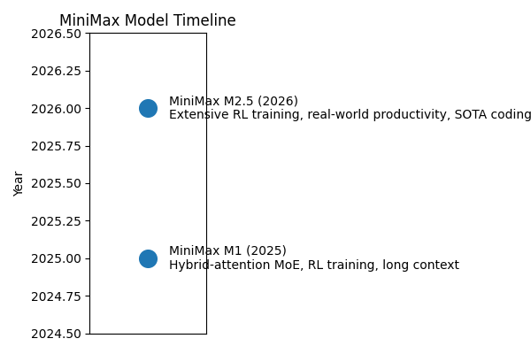


## 附录：专题与论文索引

为了便于读者深入阅读各公司/模型的详细分析和每篇论文的解读，以下提供链接索引。

### 公司专题

| 专题 | Markdown 分析 | HTML 页面 |
| --- | --- | --- |
| GLM 系列总览 | `glm_analysis.md` | `../html/glm_analysis.html` |
| Kimi 系列总览 | `kimi_analysis.md` | `../html/kimi_analysis.html` |
| DeepSeek 系列总览 | `deepseek_analysis.md` | `../html/deepseek_analysis.html` |
| MiniMax 系列总览 | `minimax_analysis.md` | `../html/minimax_analysis.html` |

### 具体论文

各论文的 Markdown 与 HTML 文件见对应专题表格：

- GLM 系列：详见 `glm_analysis.md` 中的论文索引表。
- Kimi 系列：详见 `kimi_analysis.md` 中的论文索引表。
- DeepSeek 系列：详见 `deepseek_analysis.md` 中的论文索引表。
- MiniMax 系列：详见 `minimax_analysis.md` 中的论文索引表。
# 深度解析报告：GLM、Kimi、DeepSeek 与 MiniMax 系列论文

本报告围绕四条重要的大模型研发路线——**GLM（智谱清华系）**、**Kimi（Moonshot）**、**DeepSeek（深度探索）**以及 **MiniMax**——梳理论文与技术报告的发展脉络，解释关键技术演进，并通过时间线和交叉对比深入分析各家方案的异同。报告基于公开论文、技术报告和官方新闻资料撰写，引用了相关文献和网页资料，并辅以时间线图像便于读者快速把握整体趋势。

## 1 GLM 系列研究

GLM（General Language Model）系列由智谱 AI 与清华大学合作推出，旨在探索统一的预训练架构、长期上下文建模以及工具增强推理能力。早期工作《GLM: General Language Model Pretraining with Autoregressive Blank Infilling》提出了 **自回归填空预训练** 框架，首次让填空任务与语言建模任务统一起来，奠定了 GLM 系列的预训练思想。随后发布的 **GLM‑130B** 在大规模双语预训练方面取得突破，为后续 ChatGLM 系列奠定基础。

### 1.1 ChatGLM 与 WebGLM

基于 GLM‑130B 开放权重模型，智谱推出了 **ChatGLM** 系列（从 6B 到 130B），通过监督微调和人类反馈 RLHF 构建中文友好的对话模型。伴随应用场景扩展，研究团队又提出 **WebGLM**，通过检索增强让模型能够查询实时网页以解答事实性问题。早期的 ChatGLM 通过自回归填空架构兼顾生成与理解，特别强调双语能力和兼容中文标点与 token 化规则。

### 1.2 GLM‑4 系列

进入 2024 年，智谱推出 **GLM‑4** 系列，包含多种规格：GLM‑4‑Air (9B) 面向轻量部署；GLM‑4 (2× 23B 激活) 是主力通用模型；GLM‑4V 扩展了视觉输入，可读图表识别表格；GLM‑4‑All Tools 则通过插件接口整合了搜索、代码执行、文档编辑、绘图等工具，朝多工具代理迈进。与此同时，GLM‑4.1V‑Thinking 等变体引入分层推理控制；GLM‑4‑Voice 支持实时语音识别与合成。

### 1.3 GLM‑4.5 与 GLM‑5

2025 年上半年发布的 **GLM‑4.5**（含 Air 轻量版）面向长序列和多工具推理，采用 **355B 总参数、32B 激活参数的 MoE 架构**。论文介绍了动态稀疏注意力、参数共享和多轮 RLHF/AI self-play 的训练流程，并在复杂推理和代码生成任务上取得显著提升。紧接着的 **GLM‑5** 进一步强调“从 Vibe Coding 到 Agentic Engineering”的愿景，引入 **动态稀疏注意力（DSA）** 以在不牺牲长上下文能力的情况下减少训练和推理成本；通过 **异步强化学习架构** 将生成与训练解耦，提升了 RL 采样效率和稳定性。GLM‑5 在真实编程任务上取得领先性能【181247732484451†L100-L113】。

### 1.4 其他方向

除了核心语言模型，智谱团队还发布了 **CogView/CogVideo** 系列用于文本生成图像和视频，以及 **CodeGeeX、CogVLM、CogAgent** 等子项目扩展到代码生成、视觉语言和 GUI 智能体。2025 年以后，GLM 系列还推出了 **GLM‑TTS、GLM‑OCR** 等语音与文档理解模型，以及 **GLM‑5V‑Turbo** 等多模态基座模型，体现出从纯文本向多模态、工具化代理全面进化的趋势。

### 小结

GLM 系列的核心贡献在于：提出统一的自回归填空预训练框架；探索双语大模型及长上下文稀疏注意力；通过 RLHF、搜索和工具接口拓展模型能力；并逐步向 Agentic Intelligence 迈进。最新的 GLM‑5 利用动态稀疏注意力与异步强化学习，降低训练推理成本并提升真实软件工程任务表现【181247732484451†L100-L113】。

## 2 Kimi 系列研究（Moonshot）

Moonshot 发布的 **Kimi** 系列聚焦 **Agentic Intelligence**，强调多阶段强化学习、工具使用和安全监督。

### 2.1 Kimi k1.5 与 Muon 优化器

早期的 **Kimi k1.5** 探索了如何在大模型训练中引入强化学习并扩展思维步骤（thinking budget）。团队提出 **Muon** 优化器，用于提升 token 效率并降低训练波动，为后续发展打下基础。

### 2.2 Kimi K2 技术报告

2025 年发布的 **Kimi K2** 是一款 **1 万亿总参数、32 亿激活参数的稀疏混合专家 MoE 模型**。论文摘要指出：K2 采用 **MuonClip** 优化器，在 Muon 的基础上加入 **QK‑Clip** 稳定机制以应对训练不稳定问题；模型在 15.5 万亿 token 上预训练且未出现损失爆炸；在后训练阶段采用大型 **Agentic 数据合成** 管道生成工具使用演示，并结合 **可验证奖励（RLVR）和自评奖励** 的强化学习框架【74219691980676†L110-L132】。这种组合让 K2 在非思考模式（不扩展思维步骤）下就取得了 Tau2‑Bench 66.1、ACEBench 76.5、SWE‑Bench Verified 65.8 等领先成绩【74219691980676†L110-L132】。论文强调 Agentic Intelligence 是下一代模型的核心能力，提出系统化的多阶段数据合成、RL 算法和基础设施设计【74219691980676†L167-L200】。

### 2.3 Kimi K2.5 与视觉模型

随后发布的 **Kimi K2.5**（2026 年初）在 K2 基础上扩展至 **多模态 Agentic Intelligence**，融入视觉编码器，使模型能够处理图像并在复杂环境中规划。技术报告指出 K2.5 在视觉-语言任务和代理任务上都取得显著提升，展现出面向真实工作的综合 AI 能力。

### 小结

Kimi 系列的贡献在于：提出 Muon/MuonClip 优化器提升 token 效率；通过大规模自合成数据与 RL 探索 Agentic Intelligence；并在 K2 及之后版本中融合多模态能力。Kimi K2 通过 MuonClip 优化器和 RLVR+自评奖励框架达到了开放源模型中领先的 Agentic 表现【74219691980676†L110-L132】。

## 3 DeepSeek 系列研究

DeepSeek 由深度探索公司推出，致力于推进开源大模型的规模与效率。核心论文 **《DeepSeek LLM: Scaling Open‑Source Language Models with Longtermism》** 给出了两条主要结论：一是通过实证分析提出适用于 7B 与 67B 两种规模的 **Scaling Law**；二是为支持预训练构建了 **包含 2 万亿 token 的中英双语数据集**，并通过监督微调与偏好优化构建出 DeepSeek Chat 模型【233822673875642†L71-L85】。评测结果表明，67B 模型在代码、数学和推理领域超越了 LLaMA‑2 70B，在开放式评测中也优于 GPT‑3.5【233822673875642†L71-L85】。

随后，DeepSeek 推出了一系列衍生模型：

* **DeepSeekMoE**：探索极致稀疏专家模型，提出专家隔离与共享策略以提升负载均衡，模型规模扩展至 16B 和 145B。
* **DeepSeek‑Coder** 与 **DeepSeek‑Coder‑V2**：面向代码生成和多语言编程任务，利用 MoE 架构取得比闭源模型更高的编程基准成绩。
* **DeepSeekMath**：在数学推理上通过更大规模的预训练与 RL，推动 7B 模型在 GRPO 等基准上超越同规模开源模型。
* **DeepSeek‑VL/VL2**：加入视觉编码器，通过混合专家提升视觉语言理解；
* **DeepSeek‑V2、V3 系列**：使用多头潜在注意力（MLA）结合稀疏专家扩展上下文，最新的 **DeepSeek‑V3.2** 在 DSA、RL 和 Agentic 任务合成方面继续进化。

此外，DeepSeek 还发布 **DeepSeek‑Prover/Prover‑V1.5/V2** 用于定理证明，**DeepSeek‑R1** 探索通过强化学习提升推理能力，**Native Sparse Attention** 则关注硬件对齐的稀疏注意力结构。这些子方向共同完善了 DeepSeek 生态，从基础语言模型到多模态、推理与代理应用。

## 4 MiniMax 系列研究

MiniMax 由深圳的 MiniMax AI 公司推出，聚焦于开源权重、大规模混合注意力模型以及真实世界生产力。其开放权重的 M1 和 M2.5 版本为研究界提供了可复现的超大模型。

### 4.1 MiniMax‑M1

**MiniMax‑M1** 是全球首个开放权重的混合注意力大型推理模型。根据项目 README，M1 基于前代 MiniMax‑Text‑01，拥有 **456 亿参数总量（激活 45.9 亿）**，并使用 **混合专家架构结合 lightning attention**。该模型原生支持 **100 万 token 的长上下文**，是 DeepSeek R1 的 8 倍；Lightning attention 机制让模型在 10 万 token 长度下推理 FLOPs 仅为 DeepSeek R1 的 25%，适合处理长输入和复杂任务。M1 使用大规模强化学习在数学推理和软件工程环境中训练，论文提出 **CISPO 算法**——一种剪切重要性采样权重而非剪切 token 更新的 RL 算法，使混合专家 RL 训练更稳定。此外，团队分别训练了 **40K 与 80K 思考预算** 的两个版本，实验表明 M1 在软件工程、工具使用和长上下文任务上优于 DeepSeek‑R1 和 Qwen3‑235B 等模型【132075084091887†L411-L437】。

### 4.2 MiniMax‑M2.5

2026 年发布的 **MiniMax‑M2.5** 以“面向真实生产力”为目标。新闻稿指出：M2.5 在 **数十万真实环境中通过强化学习** 训练，在代码、工具调用、搜索和办公任务中达到领先水平，基准成绩包括 **SWE‑Bench Verified 80.2%、Multi‑SWE‑Bench 51.3%、BrowseComp 76.3%**【195727672155230†L110-L120】。模型通过高效任务分解加快执行速度，在 SWE‑Bench Verified 中比 M2.1 快 **37%**【195727672155230†L110-L120】。M2.5 还提出“廉价到无需担忧”的定价策略：以 100 token/s 的速率运行一小时仅需 **1 美元**，50 token/s 仅需 **0.3 美元**【195727672155230†L123-L127】。在编程任务上，M2.5 能像架构师一样先规划需求与设计，再编写代码；训练覆盖 **10+ 种编程语言** 和 **20 万真实环境**，支持从需求分析到测试的完整开发流程【195727672155230†L137-L151】。在搜索与工具调用方面，模型针对真实复杂网页的深度探索能力提升，构建了 **RISE** 基准并表现出色【195727672155230†L169-L190】。办公场景中，M2.5 与金融、法律等专业人士合作，训练出在 Word、PowerPoint 和 Excel 等任务中能生成专业文档和建模的智能体【195727672155230†L192-L207】。效率方面，M2.5 通过强化学习优化推理路径和并行工具调用，在 SWE‑Bench Verified 中平均 token 消耗和运行时间显著下降，且成本仅为竞争模型的十分之一【195727672155230†L221-L239】。该模型还推出 **M2.5-Lightning** 版本，吞吐 100 token/s，成本更低【195727672155230†L234-L241】。为了支持大规模 RL，MiniMax 自研 **Forge RL 框架** 和异步调度策略，并结合 **CISPO** 与过程奖励设计实现 **40× 训练加速**【195727672155230†L261-L291】。

### 4.3 MiniMax 时间线

下图展示 MiniMax 模型的重要节点：

### 小结

MiniMax 提供了高透明度的开源权重模型。M1 通过混合专家和 lightning attention 实现极长上下文与高效推理；M2.5 在真实环境中大规模 RL 训练并实现低成本部署，强调代理任务和办公生产力，配合 Forge RL 框架和 CISPO 算法显著提升训练效率和模型能力【132075084091887†L411-L437】【195727672155230†L110-L120】。

## 5 综合比较与分析

从以上回顾可以看出，各家在模型架构、训练策略和应用侧重点上各有创新：

1. **模型结构**：GLM 系列以自回归填空和稀疏注意力为核心，Kimi 和 DeepSeek 采用多头潜在注意力（MLA）结合稀疏 MoE，MiniMax 则采用混合专家加 lightning attention 的混合模式。Kimi K2 的 MuonClip 优化器和 MiniMax M1 的 CISPO 算法都旨在提升大模型训练稳定性和效率。【74219691980676†L110-L132】【132075084091887†L411-L437】
2. **训练数据与 RL 策略**：DeepSeek 构建了 2 万亿 token 数据集并进行 SFT/DPO；Kimi K2 在 15.5 万亿 tokens 上预训练并通过合成数据与可验证奖励 RL 强化 agentic 能力；MiniMax M2.5 则直接在数十万真实环境中训练，并配套异步 RL 框架；GLM‑5 引入异步 RL 和动态稀疏注意力减少训练成本【181247732484451†L100-L113】【195727672155230†L261-L291】。
3. **应用重点**：GLM 侧重于通用对话、工具接入和多模态；Kimi 致力于 agentic 智能体，强调工具使用与自我评估；DeepSeek 关注开源生态与领域模型，如代码、数学和视觉语言；MiniMax 则面向真实世界生产力，兼顾编程、搜索和办公任务，同时控制成本。
4. **成本与效率**：MiniMax M2.5 以极低的使用价格和高吞吐率突出其商业化优势【195727672155230†L221-L239】；GLM‑5 和 DeepSeek‑V3 通过动态稀疏注意力和硬件对齐稀疏注意力减少推理成本；Kimi K2 基于 MuonClip 的 token 效率优化也兼顾了计算成本。

整体来看，四条路线都在寻求平衡模型规模、推理效率和智能体能力的最佳方案；它们不仅推动了开源社区的发展，也为真实业务场景提供了多样化的基础模型选择。

## 6 结论

GLM、Kimi、DeepSeek 和 MiniMax 系列代表了当前大模型领域的四种重要发展路径。GLM 从统一预训练框架出发，逐步拓展到多模态和工具增强，最新的 GLM‑5 强调动态稀疏与异步 RL；Kimi 通过 MuonClip 优化器和大规模合成数据探索 Agentic Intelligence，K2 已成为开源领域的佼佼者；DeepSeek 则在开源生态中持续探索极致稀疏专家模型、编程模型与数学推理；MiniMax 以开放权重和真实生产力为核心，从 M1 到 M2.5 展示了混合注意力和大规模 RL 的强大潜力。未来，这些路线可能进一步融合，比如结合异步 RL、强化学习奖励设计和灵活的混合专家架构，共同推动通用智能体的发展。

