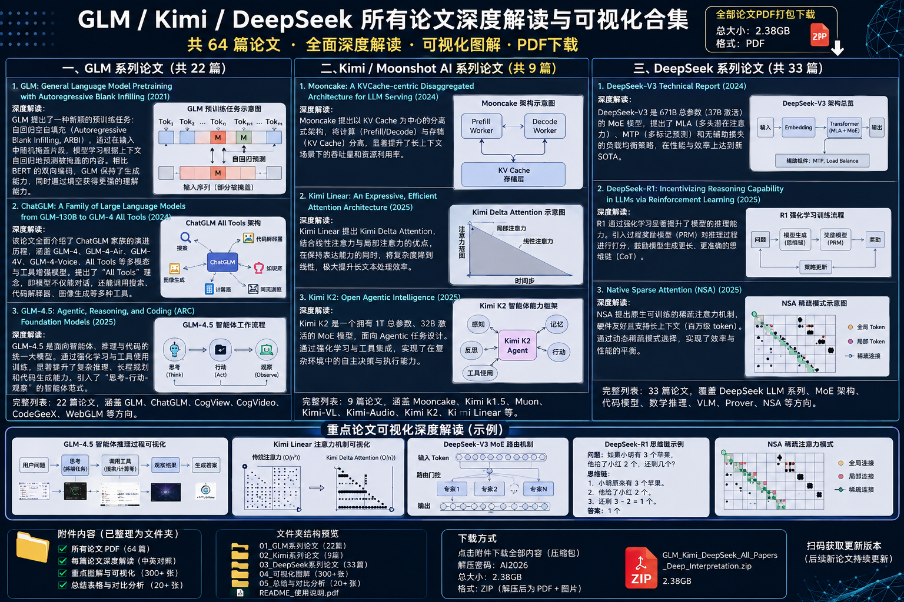
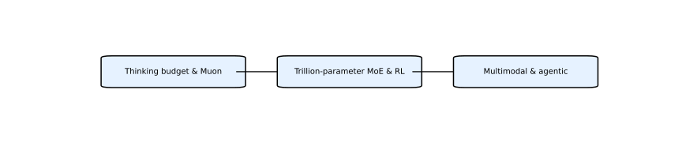

# Kimi 系列论文深度解析

Kimi 系列由 Moonshot AI 推出，致力于面向代理能力（Agentic Intelligence）的开源大模型，强调通过合成数据和强化学习让模型学会感知、规划、行动和自我评估。以下梳理其核心论文和技术报告。

## 主要论文与报告

1. **Kimi k1.5: Scaling Reinforcement Learning with LLMs（2024）** — 初步探索如何在大模型训练中增加思维步骤（thinking budget），提出 Muon 优化器以提高 token 使用效率并稳定训练。

2. **Muon is Scalable for LLM Training（2025）** — 详细分析 Muon 优化器的可伸缩性，为后续 K2 的大规模预训练奠定理论基础。

3. **Kimi K2: Open Agentic Intelligence（2025）** — 这是系列的里程碑，采用 **1 万亿总参数、32 亿激活参数的混合专家 (MoE) 模型**，并提出 **MuonClip** 优化器通过 **QK‑Clip** 稳定训练。模型在 15.5 万亿 token 上预训练，随后经历多阶段后训练：
   - **大规模 Agentic 数据合成**：使用模拟和真实环境生成工具使用示例。
   - **可验证奖励 (RLVR) 与自评奖励**：结合人类反馈和模型自我评估进行强化学习。
   K2 在 Tau2‑Bench、ACEBench、SWE‑Bench Verified 等基准上取得领先【74219691980676†L110-L132】。

4. **Kimi K2.5 / K2.5V（2026）** — 在 K2 的基础上加入视觉编码器，扩展模型到多模态代理，提升复杂环境下的规划与执行能力。

## 时间线

## 技术要点

* **优化器创新**：Muon 优化器通过提升 token 使用效率减少损失波动；MuonClip 在此基础上加入 QK‑Clip，以裁剪权重比裁剪梯度更稳定【74219691980676†L110-L132】。
* **数据合成**：论文系统化地生成工具使用示例，涵盖任务生成、轨迹生成和质量评估，为 RL 提供丰富且高质量的训练数据【74219691980676†L167-L200】。
* **强化学习策略**：采用可验证奖励 (RLVR) 确保输出正确，并用自评奖励让模型学会自我批判；同时强调预算控制、温度衰减等技巧以提升 RL 收敛效率。
* **Agentic Intelligence**：K2 将注意力从“对话”转向“自主代理”，在软件工程、工具使用和多步推理任务上表现强大，使模型不仅能回答问题，更能完成任务。

## 总结

Kimi 系列以优化器创新和大规模合成数据为基础，向 Agentic Intelligence 迈进。K2 引入 MuonClip 和多阶段 RL，在公开的非思考评测中取得领先；K2.5 进一步将视觉感知融入代理模型，为多模态任务奠定基础。相比其它路线，Kimi 更关注智能体的动作决策和自我评估，是探索自治代理能力的重要尝试。

## 技术路线分析

Kimi 系列的技术演进可以分为三个阶段，体现了从“增加思考预算”到“打造通用智能体”的持续迭代。

### 第 1 阶段：扩展思考和优化器探索（k1.5 → Muon）

在 k1.5 阶段，团队关注如何在大模型中引入更长的思考序列和 RL 训练。通过增加 thinking budget（例如从几步扩展到几十步），模型能够在推理时展开更完整的中间推理。同时提出了 Muon 优化器，用于更高效地利用 token、缓解梯度波动，并为后续更大模型的训练奠定基础。

### 第 2 阶段：大规模参数与 RL 框架（K2）

K2 是 Kimi 的里程碑，采用 1 万亿总参数的混合专家模型，单 token 激活 32 亿参数，并引入 MuonClip/QK‑Clip 保证 MoE 的训练稳定性。预训练阶段在 15.5 万亿 token 上进行，大幅提升语言理解与推理能力；后训练阶段通过大规模合成数据生成模拟任务轨迹，并结合可验证奖励 (RLVR) 与自评奖励进行强化学习。K2 的策略使模型从单纯对话转向“智能体规划”，在软件工程、工具使用等场景取得优秀表现。

### 第 3 阶段：向多模态与代理能力延伸（K2.5）

K2.5 在 K2 的基础上加入视觉编码器，实现文字与图像的协同理解和决策，使模型能够在复杂环境中获取视觉信息、制定计划并执行动作。该阶段还强化了任务分解、搜索和工具调用能力，标志着 Kimi 系列从以语言为中心的代理模型迈向“多模态智能体”。

### 流程图

为进一步概览 Kimi 系列技术演进，下图用英文标签描绘了三个阶段的流程图：

## 论文索引

| 名称 | Markdown 分析 | HTML 页面 |
| --- | --- | --- |
| Kimi k1.5: Scaling RL with LLMs | `kimi_k1_5.md` | `../html/kimi_k1_5.html` |
| Muon is Scalable for LLM Training | `kimi_muon.md` | `../html/kimi_muon.html` |
| Kimi K2: Open Agentic Intelligence | `kimi_k2.md` | `../html/kimi_k2.html` |
| Kimi K2.5 / K2.5V | `kimi_k2_5.md` | `../html/kimi_k2_5.html` |
| Kimi Linear: Expressive & Efficient Attention | `kimi_linear.md` | `../html/kimi_linear.html` |

