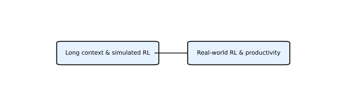

# MiniMax 系列论文深度解析

MiniMax AI 是一家开放权重大模型提供者，其 MiniMax 系列聚焦混合注意力架构、高效推理和真实世界生产力。以下总结各版本的主要特点和创新。

## MiniMax‑M1（2025）

* **模型结构**：M1 基于前代 MiniMax‑Text‑01，采用 **混合专家 (MoE) 架构与 lightning attention** 结合，总参数约 456 亿，每 token 激活 45.9 亿【132075084091887†L411-L437】。
* **长上下文能力**：模型原生支持 **100 万 token** 的上下文长度，是同代 DeepSeek‑R1 的 8 倍；lightning attention 使推理 FLOPs 在长文本下显著下降【132075084091887†L411-L437】。
* **训练方法**：使用大规模强化学习在数学推理和软件工程环境中训练，提出 **CISPO** 算法，通过剪切重要性采样权重而非梯度更新来稳定 RL 训练【132075084091887†L411-L437】。
* **模型版本**：提供 40K 和 80K 思考预算两个版本；实验证明 M1 在软件工程、工具使用和长上下文任务上优于同类开放模型。

## MiniMax‑M2.5（2026）

* **强化学习与真实环境**：M2.5 在 **数十万真实工作环境** 中通过强化学习训练，涵盖编码、搜索、工具调用和办公任务。模型在 SWE‑Bench Verified、Multi‑SWE‑Bench 和 BrowseComp 等基准上取得业界领先成绩【195727672155230†L110-L120】。
* **效率与成本**：通过高效任务分解和并行工具调用，M2.5 在完成 SWE‑Bench Verified 任务时比上一代模型 M2.1 快 **37%**【195727672155230†L110-L120】。该模型强调“智能太便宜以至于无需计费”：以 100 token/s 的速率运行一小时仅需 **1 美元**，50 token/s 仅需 **0.3 美元**【195727672155230†L123-L127】。
* **编码能力**：M2.5 会像资深架构师一样先撰写规范再编码；预训练涵盖 **10 多种编程语言** 和 **20 万真实环境**，支持从系统设计、开发、迭代到测试的完整流程【195727672155230†L137-L151】。
* **搜索与工具调用**：构建 **RISE** 基准评估模型在真实网页中的搜索能力；M2.5 在 BrowseComp、Wide Search 等任务中用更少轮次完成目标，显示更高的搜索效率和泛化能力【195727672155230†L169-L190】。
* **办公场景**：通过与金融、法律等专业人士合作，M2.5 学习在 Word、PowerPoint 和 Excel 中完成专业文档与建模任务【195727672155230†L192-L207】。
* **RL 框架**：MiniMax 自研 **Forge RL 框架**，采用异步调度和树状合并策略大幅提升训练吞吐，并设计过程奖励机制以解决长上下文信用分配问题【195727672155230†L261-L291】。

## MiniMax M3（2026）

* **Frontier 三件套**：M3 官方定位为同时具备 **Coding Frontier+、1M 上下文窗口、原生多模态** 的开放权重路线模型，配套更新 MiniMax Code。
* **MSA 长上下文**：MiniMax Sparse Attention 通过更精确的 KV 分块和 KV outer gather Q 优化长上下文计算。官方披露在 100 万上下文下，每 token 计算量约为上代模型的 1/20；prefill 超过 9 倍加速，decode 超过 15 倍加速。
* **原生多模态**：M3 从训练早期混合文本、图片、视频等模态，支持图像、视频输入与桌面操作，适合论文复现、代码审查和复杂 GUI 场景。
* **长程 Agent 训练**：M3 强调交互式用户模拟器和长时间闭环任务，让模型学习需求补充、方案讨论、反馈修正和任务切换。官方案例包括 FP8 GEMM 优化、论文复现和 PostTrainBench。
* **公开资源**：官方模型页为 <https://www.minimax.io/models/text/m3>，技术报告为 <https://www.minimax.io/blog/minimax-m3>，GitHub 入口为 <https://github.com/MiniMax-AI/MiniMax-M3>。

## 时间线

## 综合评价

MiniMax 系列的突出特点在于提供 **开放权重** 的超大模型，并着力降低推理成本和长程 Agent 使用门槛。M1 通过混合专家和 lightning attention 实现极长上下文；M2.5 将 RL 推向真实环境并大幅压缩使用成本；M3 则把 Coding、1M 上下文和原生多模态组合成面向开发者的 Frontier Agent 底座。

## 技术路线分析

MiniMax 的路线图可分为三个主要阶段，突出“开放权重 + 高效 RL + Frontier Agent”策略：

### 阶段 1：极长上下文与仿真 RL（M1）

M1 通过混合专家 (MoE) 和 lightning attention，实现 100 万 token 的长上下文处理能力，并保持推理 FLOPs 在长序列下的低消耗【132075084091887†L411-L437】。训练阶段主要在数学推理和软件工程等模拟环境中进行，并设计 CISPO 算法来稳定重要性采样权重。这一阶段验证了超长上下文对代码与推理任务的重要性。

### 阶段 2：真实环境 RL 与生产力优化（M2.5）

M2.5 把 RL 从模拟引入真实应用场景，模型在数十万真实工作环境中学习编码、搜索、工具调用和办公任务，并在 SWE‑Bench Verified、Multi‑SWE‑Bench、BrowseComp 等基准上领先【195727672155230†L110-L120】。同时借助 Forge RL 框架实现异步调度和树状合并策略，提高训练吞吐并解决长上下文的信用分配问题【195727672155230†L261-L291】；在成本方面，M2.5 以极低的 token 成本提供较快推理【195727672155230†L123-L127】。这一阶段标志着 MiniMax 模型从理论探索走向真实生产力工具优化。

### 阶段 3：Frontier Agent 三件套（M3）

M3 把 MiniMax 的路线进一步推进到长程 Agent：Coding Frontier+ 负责执行质量，MSA 支撑 1M 上下文工作记忆，原生多模态让模型处理截图、图表、视频和桌面状态。配套 MiniMax Code 说明其目标不是单轮聊天，而是仓库级开发、测试、调试和持续修复。

### 流程图

下图用英文描述总结了 MiniMax 路线的两个阶段，展示从长上下文仿真 RL 到真实环境 RL 的演进：

## 论文索引

| 名称 | Markdown 分析 | HTML 页面 |
| --- | --- | --- |
| MiniMax‑M1 | `minimax_m1.md` | `../html/minimax_m1.html` |
| MiniMax‑M2.5 | `minimax_m2_5.md` | `../html/minimax_m2_5.html` |
| MiniMax M3 | `minimax_m3.md` | `../html/minimax_m3.html` |

