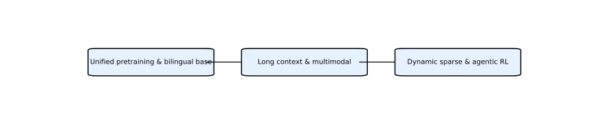

# GLM 系列论文深度解析

智谱 AI 与清华大学在 GLM 系列中探索了一条独特的发展路线：通过**自回归填空**预训练框架统一生成和理解任务，并逐步扩展到长上下文、多模态和工具调用。下面分阶段分析主要论文与技术报告。

## 主要论文与报告

1. **GLM: General Language Model Pretraining with Autoregressive Blank Infilling（2021）** — 提出自回归填空预训练框架，将填空任务（Masked Language Model）与自回归语言模型统一起来，解决了 BERT 难以生成连续文本的问题，为 GLM 系列奠定理论基础。

2. **GLM‑130B: An Open Bilingual Pre-trained Model（2022）** — 在大规模中英双语语料上预训练 130B 参数模型，是 ChatGLM 的底座。该模型开放权重，支持通用问答和对话。

3. **WebGLM（2023）** — 针对事实性问答场景，通过互联网检索增强，模型能够调用搜索引擎获取实时信息，解决脱离知识库后的时效性问题。

4. **ChatGLM 系列（2023–2024）** — 通过监督微调与 RLHF 构建中文对话模型，涵盖 6B、13B、130B 等多个规模。ChatGLM 2/3 引入了更长上下文和代码能力，在国内外 LLM 榜单中表现突出。

5. **GLM‑4 系列（2024）** — 发布 Air、标准版与 V 系列：
   - **GLM‑4‑Air（9B）**：轻量级，面向移动和边缘设备。
   - **GLM‑4（激活 2×23B）**：主力通用模型。
   - **GLM‑4V**：加入视觉输入，支持图表理解。
   - **GLM‑4‑All Tools**：构建插件接口，让模型调用搜索、代码执行、绘图等多种工具。

6. **GLM‑4.5 系列（2025）** — 采用 355B 总参数和 32B 激活的 MoE 架构，引入动态稀疏注意力和多轮 RLHF，提升长序列推理与多工具调用能力。

7. **GLM‑5 技术报告（2026）** — 强调“从 Vibe Coding 到 Agentic Engineering”，使用**动态稀疏注意力（DSA）**降低训练与推理成本，并构建**异步强化学习架构**以解耦生成与训练。报告指出 GLM‑5 在真实编程任务中达到最先进水平【181247732484451†L100-L113】。

## 时间线与趋势

下图展示了 GLM 系列的关键节点和演进方向：

## 分析与评价

* **统一预训练框架**：GLM 首先提出自回归填空（Autoregressive Blank Infilling），通过随机掩盖和自回归生成统一了双向编码和单向生成，兼顾理解与生成能力。
* **双语与多模态**：从 GLM‑130B 开始强调中英双语；GLM‑4V 进一步引入视觉输入，扩展到多模态场景。
* **长上下文与稀疏注意力**：GLM‑4/4.5 探索稀疏专家模型与动态稀疏注意力，实现更长上下文并降低计算成本。
* **工具与代理能力**：通过 WebGLM 与 GLM‑4‑All Tools，团队尝试让模型调用搜索、代码执行等外部工具；GLM‑5 中提出异步强化学习框架，明显面向智能体应用。

总体来看，GLM 系列从统一预训练出发，逐步拓展至多模态、长上下文和工具增强，并在 GLM‑5 中尝试通过异步 RL 架构推动 Agentic Intelligence，其演进方向既兼顾通用语言模型，又面向真实应用场景。
## 技术路线分析

GLM 系列的技术演进可以概括为三大阶段：

1. **模型统一与跨语言基础（2021–2022）**：起步阶段提出自回归填空框架，将掩码填空与自回归生成统一，并在 GLM‑130B 中扩展为中英双语大模型，开放权重，奠定了开放生态的基座。这一阶段重点解决如何兼顾理解与生成并适应多语言场景。

2. **长上下文与多模态扩展（2023–2024）**：随着 ChatGLM 1/2/3 和 GLM‑4 系列的推出，技术路线转向扩大模型规模、支持 32K 甚至 128K 上下文窗口，并引入稀疏专家架构和视觉编码器，实现多模态理解。同时通过 WebGLM 和 All Tools 引入检索和工具调用，初步具备智能体特征。

3. **动态稀疏与代理化训练（2025–2026）**：GLM‑4.5 和 GLM‑5 在技术上引入动态稀疏注意力，使计算成本与长序列长度脱钩；在训练上采用多阶段 RLHF、异步强化学习架构和自评奖励，以支持复杂任务规划和多工具协同。这标志着 GLM 从通用模型向 Agentic Intelligence 迈进，致力于在真实工程场景中部署。

通过上述路径，智谱 AI 逐步完善从预训练框架、模型规模扩展到任务执行框架的闭环。所附的时间线图片同时也是技术路线图，展示了每一阶段的关键成果与里程碑。

### 流程图

为方便理解，下图展示了 GLM 技术路线的阶段性流程图，使用英文标签直观表示每个阶段的核心特征：

## 论文索引

下表列出本系列中主要论文或报告以及对应的分析文件：

| 名称 | Markdown 分析 | HTML 页面 |
| --- | --- | --- |
| GLM: General Language Model Pretraining with Autoregressive Blank Infilling | `glm_autoregressive_blank_infilling.md` | `glm_autoregressive_blank_infilling.html` |
| GLM‑130B: An Open Bilingual Pre‑trained Model | `glm_130b.md` | `glm_130b.html` |
| WebGLM | `webglm.md` | `webglm.html` |
| ChatGLM 系列（含 GLM‑4‑Air/4/4V/All Tools） | `glm_chatglm_family.md` | `glm_chatglm_family.html` |
| GLM‑4.5 技术报告 | `glm_4_5.md` | `glm_4_5.html` |
| GLM‑5 技术报告 | `glm_5.md` | `glm_5.html` |
